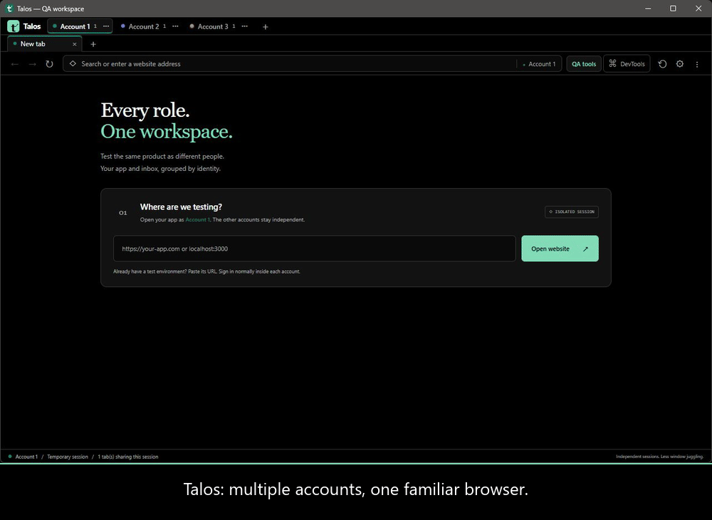

# Talos

**Every role. One workspace.**

Talos is an open-source desktop browser for QA designers and testers who work
with several identities at once. Group an application's website with that
identity's email inbox, sign into each normally, and move between roles without
juggling browser windows or logging everyone out.



Watch the 35-second walkthrough above, or [download the MP4](docs/media/talos-demo.mp4).
It uses a local demo website and pretend identities. [Demo steps and transcript](docs/demo.md).

**1.0 release candidate:** Talos targets Windows, macOS and Linux, including
Omarchy/Hyprland. Windows is locally verified; native macOS, Linux and Wayland
checks run in [GitHub Actions](https://github.com/GeorgePersson/Talos/actions).
Real Omarchy/Hyprland acceptance and real provider sign-in remain release gates.
See [the Linux guide](docs/linux.md) and [1.0 acceptance checklist](docs/roadmap.md).

No Docker is needed. Packaged downloads include their runtime; Node.js is only
needed to develop from source. Get published builds from
[Releases](https://github.com/GeorgePersson/Talos/releases). Candidates are marked
as prereleases and builds are currently unsigned. Check the release's OS/CPU
labels, installation notes and `SHA256SUMS.txt` before use.

Have an idea? Join [Discussions](https://github.com/GeorgePersson/Talos/discussions),
use a [bug or feature form](https://github.com/GeorgePersson/Talos/issues/new/choose),
or read [CONTRIBUTING.md](CONTRIBUTING.md) to submit a pull request.

## Run it

Requires Node.js 22.12 or newer (Node 24 recommended).

```sh
npm ci
npm start
```

The first workspace has three temporary groups: **Account 1**, **Account 2**, and
**Account 3**. Enter your application URL in each group and sign into a different
account. `localhost:3000` works for development sites too.

These are starting labels, not fixed roles. Rename groups for your own testing
workflow and add as many as you need within the workspace limits. Existing
saved workspaces keep their group names when you update Talos.

Groups appear in a compact row at the top, with a **+** button immediately after
them to create another group. The row below shows only the selected
group's tabs, and switching groups restores the last tab you used there. Open a
normal tab in a group and enter its webmail URL, or create a group with both a
website URL and an inbox URL. Talos loads your email provider's
website; it does not connect over IMAP, read messages in the background, store
passwords itself, or send emails. Use the tab row's **+** button to open additional
pages with the group's existing login.

## What works

- Named, coloured identity groups with an isolated browser session per group.
- Compact two-level group/tab navigation and a black/white interface with a mint green accent.
- Appearance settings with colour pickers, hex inputs, live preview and saved palettes.
- Website and inbox tabs kept together under the identity they belong to.
- Deliberately shared sessions across a group's tabs and authentication popups.
- Temporary groups by default; opt into a saved session when creating a group.
- Back, forward, reload, stop, editable addresses, and per-tab DevTools.
- Browser-style context menus, duplicate/reopen/drag tabs, middle-click close,
  find-in-page, zoom, and address-bar search (DuckDuckGo).
- A focused QA toolbox with a Playwright locator picker, API tester and live
  Playwright connection instructions. Network, console and other inspection stay
  in Chromium DevTools.
- An API client for GET, POST, PUT, PATCH, DELETE, HEAD and OPTIONS, with custom
  headers/body, optional group authentication, response headers, timing, and a
  JSON/text response preview.
- Full Chromium DevTools docked right, bottom, or in a separate window, plus
  screenshot capture for the current page.
- Opt-in live Playwright integration using a local CDP endpoint and a group-aware
  adapter. See [the integration guide](integrations/playwright/README.md).
- Group rename, session reset, and account removal.
- Session reset closes the group's pages and popups, clears storage, cache and
  HTTP authentication data, then reopens its tabs. Other groups keep their data.

Persistence is chosen when creating a group because Electron's in-memory and
persistent partitions are different sessions. To change that choice, create a
new group and sign in again. Saved workspace URLs omit query strings and
fragments to avoid saving login callback tokens; the resumed URL may therefore
need to be entered again for applications that depend on those parts.

| Shortcut | Action |
| --- | --- |
| Ctrl / Cmd + L | Focus the address bar |
| Ctrl / Cmd + T | New shared tab in the current group |
| Ctrl / Cmd + Shift + N | New isolated group |
| Ctrl / Cmd + Shift + T | Reopen closed tab |
| Ctrl / Cmd + W | Close current tab |
| Ctrl / Cmd + R | Reload page |
| F12 | Current tab's DevTools |
| Ctrl / Cmd + Shift + I | Current tab's DevTools |
| Ctrl / Cmd + F | Find in current page |
| Ctrl / Cmd + plus, minus, 0 | Zoom in, out, reset |
| Ctrl + Tab / Ctrl + Shift + Tab | Next / previous tab in the selected group |
| Alt + Left / Right | Back / forward |
| Ctrl / Cmd + Shift + Q | Toggle QA toolbox |
| Ctrl / Cmd + , | Open settings |

Rename a group with its `…` button, double-click its name, or right-click for
**Rename group**. Use the tab bar's `+`, the group’s menu, or Ctrl/Cmd+T for
extra tabs. Right-click a tab to duplicate it or close other tabs in its group.

Open **Settings** using the gear beside the address bar, the browser's File menu,
or Ctrl/Cmd+comma. Choose the background, text and accent colours; panels, controls,
dialogs and QA tools adapt to the palette. Changes preview immediately. **Save
changes** keeps the palette across restarts; **Back to browsing** or Escape
discards unsaved changes. **Reset to defaults** previews the original black/white
and green palette; save it to make the reset permanent. These settings apply only
to Talos's interface. Websites and Chromium DevTools keep their own styling.

## QA toolbox

Open **QA tools** beside the address bar. The drawer contains **Locator picker**,
**API tester**, and **Playwright** connection details.

Choose **Pick an element**, hover over the active website, then click an element.
Talos returns a copyable [Playwright locator](https://playwright.dev/docs/locators),
using a unique `data-testid`, a unique role and accessible name, or a CSS fallback.
The selection click is captured without activating the element. Escape or
**Cancel picking** stops the picker. Switching tabs, navigating, closing the
panel, resetting a group, or opening Settings also stops picking. It works in
normal pages, open shadow roots and same-process iframes, with `frameLocator()`
added for iframe content. Closed shadow roots and cross-process frames may need
Playwright's own code generator. Review generated selectors in your tests;
CSS paths can change when the DOM changes. Custom test ID attributes use a CSS
fallback rather than assuming your Playwright configuration.

The picker uses a temporary local Chromium debugger connection; it does not
require automation mode or open a debugging server. Close the active tab's
DevTools before picking. Picked metadata stays in memory and is cleared when its
tab navigates or closes.

The API editor uses the selected group's cookies and HTTP authentication when
the session checkbox is enabled. Disable it for a separate in-memory request
session. Headers can include an explicit Authorization value. Redirects return
their status and headers without following them; bodies/responses are capped at
2 MiB, requests time out after 30 seconds, and group reset cancels active requests.
It is a developer request tool, so calls are made from the main process and are
not restricted by the website's CORS policy. Use DevTools to reproduce browser
CORS failures. API request drafts and response previews remain in memory only.
Use **DevTools** beside the address bar or F12 for Network, Console, Elements,
responsive device mode, performance, storage, accessibility, throttling and
request blocking. Talos does not duplicate those panels or record a second
network/console log. Request collections, environment variables, arbitrary
browser extensions, and an in-app automation runner are not yet implemented.

Closing a group's last tab leaves a blank tab in that group and keeps its login.
Use **Reset session** or **Remove account** to clear the group's data.

## Try the local demo

```sh
npm run demo
```

Open `http://127.0.0.1:4173` in several groups. Sign in with a pretend identity in
each. Open `http://127.0.0.1:4173/inbox` in another tab in the same group to try the
demo inbox. For real email, use your Gmail, Outlook or other webmail website;
Talos does not provide an inbox service. The page displays its
cookies, local and session storage, IndexedDB, Cache Storage, and service worker
count. Use shared tabs and reset to see the difference. This is a local storage
fixture, not a real authentication or email service.

## Login compatibility

Try your real application's **and email provider's** sign-in before relying on
Talos. Some identity providers prohibit or block embedded browsers, including
[Google's OAuth policy](https://developers.google.com/identity/protocols/oauth2/policies#disallowed_useragents).
Talos preserves `window.opener` and the group's session for normal login popups,
but does not spoof a browser, disable web security, bypass provider restrictions,
or route custom-protocol authentication to an external app. Gmail and other
webmail providers requiring a blocked embedded sign-in may not work.

Use it as a QA companion and still validate your product in the browsers you
officially support. Extensions, password-manager integration, device permissions
(camera, microphone, location, etc.), split views, and real
mail-service integration are outside this first version.

## Data and security

Each group has a random Electron session partition. Temporary partitions are
in memory; saved partitions use `persist:` and store session data in the app's
user-data directory. Saved cookies and website data follow Chromium's normal
storage behaviour; Talos does not add encryption or a master password. No
telemetry or remote application shell is included.

Isolation covers browser-session data, not IP addresses, operating-system SSO,
server-side sessions, or the email/app accounts themselves. A reset leaves
downloaded files on disk and does not erase server logs. Persistent group metadata
and website paths are stored in `workspace.json`. If cleanup fails, that group
stays blocked, including across restart, until reset is retried successfully.
Interface colour preferences are stored separately in `preferences.json` and
remain in place when a group is reset or removed.

Remote websites have no Node.js integration or preload bridge. Sandboxing,
context isolation, and normal web security are enabled. Only the trusted local
shell can invoke the validated IPC commands. Top-level remote navigation accepts HTTP(S)
and blank pages only; embedded documents can also use normal srcdoc, data and
blob frames. The trusted interface uses a restricted `talos://app` protocol in
its own in-memory partition. Only one process can use a profile at a time.
Up to 30 groups, 100 tabs, eight popups and five active downloads per group are
allowed. Download save dialogs include the group name; reset cancels active
downloads. See [SECURITY.md](SECURITY.md) and
[Electron's security guidance](https://www.electronjs.org/docs/latest/tutorial/security).

## Develop and verify

```sh
npm run typecheck
npm test
npm run check
npm run pack
npm run dist
```

Tests launch the actual Electron app against a local HTTP fixture using a
separate temporary user-data directory. They exercise isolated storage, HTTP
cache, shared tabs, inbox grouping, popups, reset, restart persistence, blocked
schemes, page failures, authenticated/fresh API requests, request cancellation
and live Playwright connections. Locator tests exercise real pointer selection,
copying, duplicate names, open shadow roots and same-origin iframes, and verify
the generated locators against the live pages using Playwright. They also exercise group/tab selection, full-width website bounds,
search submission through the real address bar, and URL/search-operator parsing.
No production login credentials are needed.

`npm run pack` creates an unpacked application in `release/`; `npm run dist`
builds distributables for the current OS and CPU architecture:

| Platform | Distributables |
| --- | --- |
| Windows | Installer and portable executable |
| Linux (including Omarchy) | AppImage and portable tar.gz with launcher installer |
| macOS (Intel / Apple Silicon) | DMG and ZIP |

Explicit commands are `npm run dist:linux`, `npm run dist:windows` and
`npm run dist:mac`. Build on the target OS; pass `-- --x64` or `-- --arm64` to
choose a CPU architecture. `npm run smoke:packaged -- --automation` verifies
the packaged app and bundled Playwright adapter. Set `TALOS_EXECUTABLE` to check
a build at a custom path. The GitHub Actions workflow runs tests, builds native
distributables, and retains downloadable artifacts. Version tags create a draft
release only when every check passes; see [the release process](docs/releases.md).
Release builds are unsigned until maintainers configure signing and macOS
notarization. macOS may block unsigned downloads through Gatekeeper.

The project uses plain TypeScript and CSS, esbuild, Electron `WebContentsView`,
Playwright, and electron-builder. The build-time `global-agent` dependency is
overridden to its current major version to avoid the old `sprintf-js` dependency.

- `src/main.ts`: sessions, page lifecycle, popup policy, persistence, IPC.
- `src/preload.ts`: a narrow bridge available only to the local shell.
- `src/renderer.ts`, `src/styles.css`: groups, tabs, addresses and dialogs.
- `src/shared.ts`, `src/url.ts`: command types and URL policy.
- `src/qa.ts`, `src/tools.ts`: API requests and QA toolbox UI.
- `src/locator.ts`: isolated-world inspection and Playwright locator suggestions.
- `src/automation.ts`, `integrations/playwright/`: opt-in CDP and live test adapter.
- `tests/browser.spec.ts`: actual Electron integration tests.

See [CONTRIBUTING.md](CONTRIBUTING.md). Licensed under the [MIT license](LICENSE).
See [project governance](GOVERNANCE.md), [community conduct](CODE_OF_CONDUCT.md),
[the roadmap](docs/roadmap.md) and [changelog](CHANGELOG.md).
